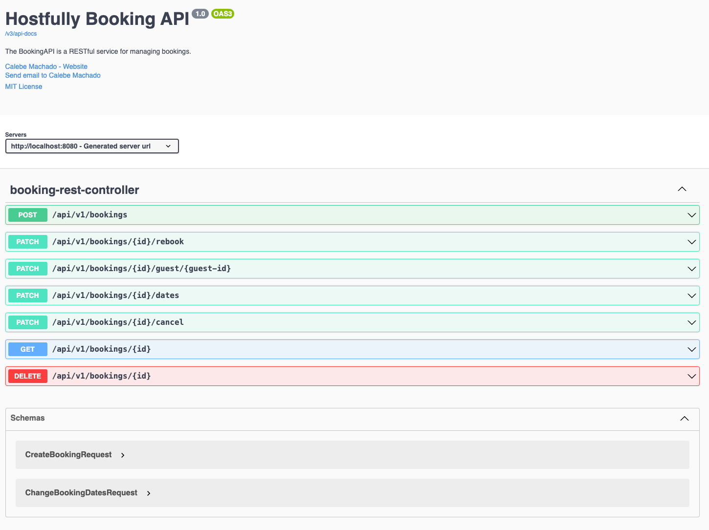

# Hostfully Booking API

This is a RESTful webservice written with Spring Boot to perform booking operations like:

- [x] Create a booking
- [x] Update booking dates and guest details Cancel a booking
- [x] Rebook a canceled booking
- [x] Delete a booking from the system
- [x] Get a booking
- [x] Create, update and delete a block

## Folder Structure

```
└─ .
   ├─ README.md
   ├─ mvnw
   ├─ mvnw.cmd
   ├─ pom.xml
   └─ src
      ├─ main
      │  ├─ java
      │  │  └─ com
      │  │     └─ hostfully
      │  │        └─ booking
      │  │           └─ api
      │  │              ├─ BookingApi.java
      │  │              ├─ application
      │  │              │  └─ rest
      │  │              │     ├─ BookingRestController.java
      │  │              │     ├─ PersonRestController.java
      │  │              │     ├─ request
      │  │              │     │  ├─ ChangeBookingDatesRequest.java
      │  │              │     │  └─ CreateBookingRequest.java
      │  │              │     └─ response
      │  │              │        └─ BookingResponse.java
      │  │              ├─ domain
      │  │              │  ├─ BaseEntity.java
      │  │              │  ├─ Person.java
      │  │              │  ├─ Place.java
      │  │              │  ├─ Reservation.java
      │  │              │  ├─ ReservationStatus.java
      │  │              │  ├─ ReservationType.java
      │  │              │  ├─ repository
      │  │              │  │  ├─ PersonDAO.java
      │  │              │  │  └─ ReservationDAO.java
      │  │              │  └─ services
      │  │              │     ├─ BlockService.java
      │  │              │     ├─ BookingService.java
      │  │              │     └─ adapter
      │  │              │        ├─ BlockAdapter.java
      │  │              │        └─ BookingAdapter.java
      │  │              └─ infrastructure
      │  │                 ├─ configuration
      │  │                 │  ├─ BeanConfiguration.java
      │  │                 │  ├─ ErrorResponse.java
      │  │                 │  └─ GlobalExceptionHandler.java
      │  │                 ├─ exception
      │  │                 │  ├─ BusinessException.java
      │  │                 │  └─ NotFoundException.java
      │  │                 └─ repository
      │  │                    ├─ PersonDAODatabase.java
      │  │                    └─ ReservationDAODatabase.java
      │  └─ resources
      │     ├─ application-prod.yaml
      │     ├─ application.yaml
      │     ├─ db
      │     │  └─ migration
      │     │     ├─ V1__CREATE_PERSON.sql
      │     │     └─ V2__CREATE_RESERVATIONS.sql
      │     ├─ static
      │     └─ templates
      └─ test
         ├─ java
         │  └─ com
         │     └─ hostfully
         │        └─ booking
         │           └─ api
         │              ├─ BookingApiTests.java
         │              ├─ integration
         │              │  └─ PersonDAOIntegrationTest.java
         │              └─ unit
         │                 ├─ PersonTest.java
         │                 └─ ReservationTest.java
         └─ resources
            ├─ application-test.yaml
            └─ database
               └─ person-data.sql

```

## Architecture Design Principles

The architecture design of this project is inspired by the Ports and Adapters pattern, also known as [Hexagonal Architecture](https://jmgarridopaz.github.io/content/hexagonalarchitecture.html). While **we have not adhered strictly** to the model, we have tailored our implementation to focus on aspects that deliver the most value for a project of this scale.


Inside src/main/java we have the main package `com.hostfully.booking.api`

- Application:
  - In and Out ports for interaction with the API;
  - Models to represent API contracts;
- Domain:
  - Core models;
  - Business logic;
  - Business interfaces;
- Infrastructure
  - Repository adapters to handle external resources;
  - Frawework configurations;
  - Custom exceptions handling;

Inside src/main/test we have main package too `com.hostfully.booking.api`, but holding tests.

- Integration
  - Tests that depend on external resources like databases;
- Unit
  - Tests that try to focus on the domain entities logic and business logic;

## Tech Stack

**Back-end:** Java 21, Spring Boot, H2 (in-memory database), Flyway, Lombok, Junit5, Maven, Swagger

## Running locally

Clone the project

```bash
  git clone https://github.com/calebemachado/booking-api.git
```

Install

```bash
  ./mvnw clean install
```

Run the app

```bash
    ./mvnw spring-boot:run
```

Run the tests

```bash
    ./mvnw test
```

- Obs1.: Remember that we are using H2 database, it won't hold you data after the app closes or restart.
- Obs2.: For some integration tests that rely on dates, they can fail because of the usage of `LocalDateTime.now()`. Given some limitations with H2, it was not effective the usage of functions like `NOW()` direct on the insertions of mock data. To fix that, just verify which tests failed and look for mock .sql files inside test/resouces/database folder, changing the dates.

## API Documentation

After you run the application, go to your browser and navigate to:

```bash
  http://localhost:8080/swagger-ui/index.html
```
You should see all the rest endpoints available for this API, like above image:



## TODOs
- Add Authentication/Authorization
- Implement Rate Limiting using local cache
- Add local or distributed cache to common endpoints that does not change much
- Dockerize application
- Create separated profiles for environments (local, sandbox, production-canary, production)
- Use CI/CD
- Add images to places, storing in some sort of bucket (ex.: AWS S3)
- Add monitoring generating metrics allowing the creation of alerts
- Add logs for complex operations
- Add internationalization with messages for each language necessary